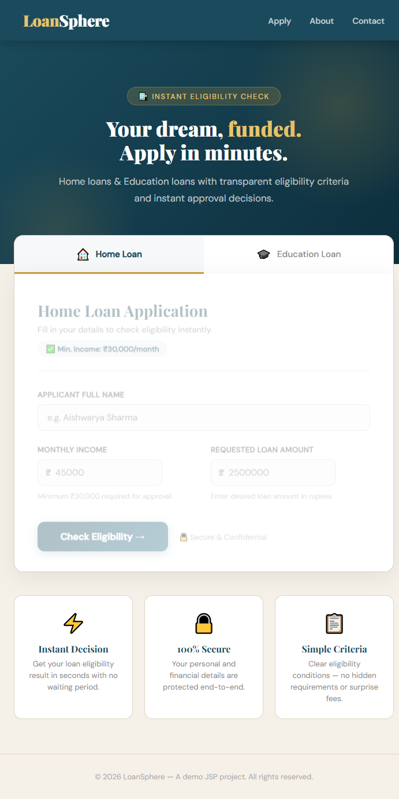
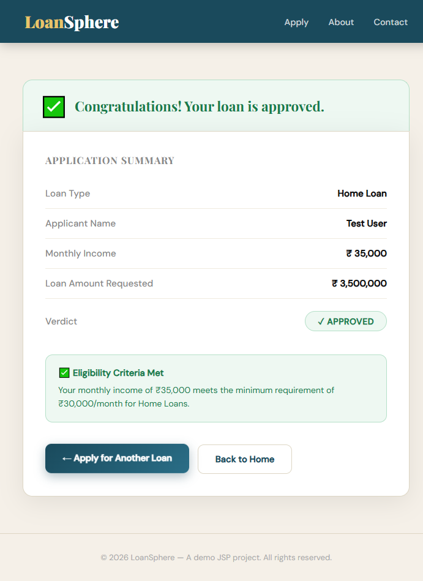

# LoanSphere — JSP Dynamic Web Application

A modern, JSP-based loan management web app converted from the original Java console project.

---

## 📁 Project Structure

```
LoanProject/
├── pom.xml                          ← Maven build file
└── src/
    └── main/
        ├── java/com/loan/
        │   ├── Loan.java            ← Interface
        │   ├── HomeLoan.java        ← Home loan logic (income ≥ ₹30,000)
        │   ├── EducationLoan.java   ← Education loan logic (marks ≥ 60%)
        │   └── LoanServlet.java     ← Controller servlet
        └── webapp/
            ├── WEB-INF/
            │   └── web.xml          ← Deployment descriptor
            ├── index.jsp            ← Loan application form
            ├── result.jsp           ← Eligibility result page
            └── error.jsp            ← Error page
```

---

## ⚙️ Requirements

| Tool       | Version     |
|------------|-------------|
| Java       | 17+         |
| Maven      | 3.8+        |
| Tomcat     | 10.x        |
| IDE        | IntelliJ / Eclipse (optional) |

---

## 🚀 How to Run

### Option 1: Deploy on Apache Tomcat

1. **Build the WAR file:**
   ```bash
   mvn clean package
   ```
2. Copy `target/LoanProject-1.0-SNAPSHOT.war` to `TOMCAT_HOME/webapps/LoanProject.war`
3. Start Tomcat:
   ```bash
   TOMCAT_HOME/bin/startup.sh    # Linux/Mac
   TOMCAT_HOME/bin/startup.bat   # Windows
   ```
4. Open browser: `http://localhost:8080/LoanProject/`

### Option 2: IntelliJ IDEA

1. Open project → File → Open → select `pom.xml`
2. Add Tomcat 10 server configuration (Run → Edit Configurations → Tomcat Local)
3. Deploy artifact: `LoanProject-1.0-SNAPSHOT.war`
4. Click Run ▶

### Option 3: Eclipse

1. Import → Maven Project → select project folder
2. Right-click → Run As → Run on Server (Tomcat 10)

---

## 🏦 Loan Eligibility Rules

| Loan Type      | Criteria                        | Result      |
|----------------|---------------------------------|-------------|
| Home Loan      | Monthly Income ≥ ₹30,000        | ✅ Approved  |
| Home Loan      | Monthly Income < ₹30,000        | ❌ Rejected  |
| Education Loan | Academic Score ≥ 60%            | ✅ Approved  |
| Education Loan | Academic Score < 60%            | ❌ Rejected  |

---

## 🌐 Pages

| URL                  | Description              |
|----------------------|--------------------------|
| `/`                  | Loan application form    |
| `/index.jsp`         | Loan application form    |
| `/applyLoan` (POST)  | Loan processing servlet  |
| `/result.jsp`        | Eligibility result page  |

## 🖼️ Screenshots





---

## 🔄 Flow

```
User fills form (index.jsp)
        ↓
POST /applyLoan (LoanServlet)
        ↓
HomeLoan / EducationLoan logic
        ↓
Forward to result.jsp with attributes
        ↓
Display result with approval/rejection
```

---

## 🧱 Technologies Used

- **Java 17** — backend logic
- **Jakarta Servlet 6.0** — request handling
- **JSP (JavaServer Pages)** — dynamic views
- **Maven** — build & dependency management
- **Apache Tomcat 10** — application server
- **HTML5 / CSS3 / Vanilla JS** — frontend UI
